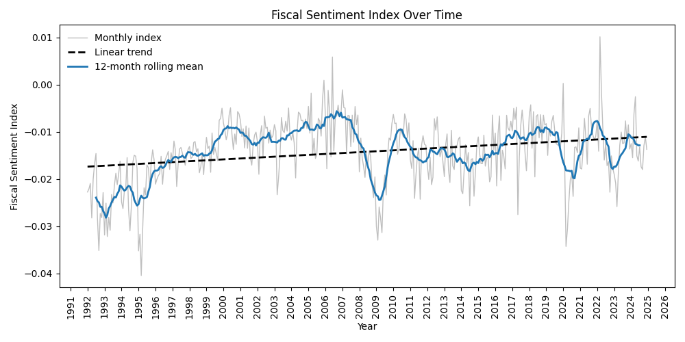

# Media Simialrity Analysis of Swedish News Articles (NLP Project) 

## Overview 
This project develops a semantic media similarity index for Swedish news articles using transformer-based language models. The objective is to quantify how closely media narratives align with expansionary or contractionary fiscal policy language.

The project was conducted in connection with my bachelor thesis and was used to construct a media narrative index for Swedish fiscal policy. The resulting index was designed for use in time-series econometric analysis of macroeconomic structures.

The methodology combines topic modeling, transformer-based embeddings, cosine similarity scoring, and time aggregation to transform unstructured text data into a structured economic indicator.

## Objective 
The primary objective is to quantify narrative alignment in Swedish media coverage of fiscal policy by:

- Embedding news articles using a Swedish sentence-transformer model
- Measuring semantic similarity between articles and predefined fiscal policy prompts
- Constructing a polarity-based media narrative score
- Aggregating scores into a monthly time-series index

The resulting index captures shifts in media tone regarding fiscal expansion versus fiscal contraction.

## Methodology 

### Preprocessing 

In the orignal work over 60 000 artciles where scraped, however due to the data scraping platform and low computational power, every file had a maximum of 500 articles and where in the txt format. 

Due to the the data collection being limitied in the amount and way it could be retrieved, the following code transformers multiple files from txt file into a csv, which enable easier analysis and interpretation of the data. 

🖥️ Script: [Data_preprocessing](/src/preprocessing.py)

### Topic Filtering via LDA

Furhtermore, to narrow down the scope and remove as many irrelevant articels as possible, I performed a latent dirchlet allocation (LDA) to find appropiate keywords when searching for the correct articles. This was done by first scraping data with general keywords then using that inital information to find the correct keywords, to finally scrape the final data set. With this method I could get a more general media narrative of Swedish policy and lower the chances of articles investigating other topics, such as sports, other countires fiscal policy, and more. 

🖥️ Script: [LDA](/src/LDA.py)

**📈 Static Preview:** 

👉 **[Open interactive LDA visualization](/figures/ldavis_5.html)**

### Text Embeddings and Variable Creation

**Model:** [KBLab/sentence-bert-swedish-cased](https://kb-labb.github.io/posts/2021-08-23-a-swedish-sentence-transformer/)

**Platform:** Hugging Face

**Rationale:** Language-specific model optimized for Swedish semantic representation.

Each article embedding was compared to predefined fiscal policy prompts using cosine similarity.

|Positive Prompt|Negative Prompt|
|:---------------:|:---------------:|
|Regeringen kommer at öka budgeten|Regeringen minskar budgeten|
|Staten höjer de offentliga utgifterna|Staten ska spara mer|
|Finanspolitiken blir mer expansiv|Finanspolitiken stramas åt|
|Budgetutrymmet ökar|Offentliga utgifterna minskar|
|Regeringen satsar mer pengar|Nedskärningar i budgeten|

### Polarity & Index Construction 
With a similarity index for every promt in each article created, a polarity score was also conducted. To find the differences for every prompt 

With the simialrity score for each article being completed, the sentence simialrity socre was the averaged out for each month. Also a weight as applied for every articel to futher minimize the effect of more irrelevant articels. This weight basically takes the highest similarity score a prompt has on one article and then multiplies this with the polartity score. 

🖥️ Script: [Data_preprocessing](/src/embed_sim_score.py)

## Data 
Due to licensing restrictions from a commercial media monitoring provider, the original article texts cannot be shared. Synthetic and public-domain examples are included to demonstrate the full methodology.

This means that the csv file called [synthetic_articles.csv](data/synthetic_articles.csv) is only a exampale of how the data set look, not including any real articles. 

## Results 

The constructed Media Narrative Index displays clear variation over time and can be used in macroeconomic or financial time-series models.

🖥️ Script: [Visualization](/src/figure_media_index.py)

## Contribution 
This project demonstrates how transformer-based NLP models can convert unstructured media text into a structured economic indicator suitable for quantitative analysis.

It bridges:
- Natural Language Processing
- Economic Theory
- Time-Series Modeling

# Technical Details 
- **Analysis Tool:** Python
- **Large Language Model:** KBLab/sentence-bert-swedish-cased from the platform Hugging Face
- **Visualization:** Python 